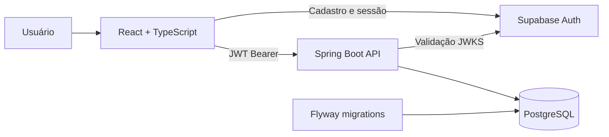

# Gabarita.ai

Plataforma de preparação para concursos públicos que transforma edital, disponibilidade e desempenho em um plano de estudo executável. O sistema reúne cronograma inteligente, banco de questões, revisões, simulados, análise de desempenho e gestão de conteúdo em uma experiência responsiva.

## Visão geral

O Gabarita.ai foi projetado para responder três perguntas do candidato:

1. **O que estudar agora?** O plano organiza disciplinas e assuntos de acordo com prioridade, peso, dificuldade e tempo disponível.
2. **Como praticar?** O banco de questões oferece filtros hierárquicos, sessões cronometradas e correção orientada ao aprendizado.
3. **Onde melhorar?** Os painéis consolidam acertos, erros, evolução, sequência de estudos e pontos que precisam de revisão.

### Principais recursos

- Planos personalizados para diferentes concursos e cargos.
- Cronograma diário com redistribuição conforme o tempo disponível.
- Roadmap por disciplina e assunto.
- Banco de questões com taxonomia organizada e filtros avançados.
- Gabaritos completos com conceito, análise do item, pegadinhas e dicas de fixação.
- Simulados persistentes com pausa, retomada e resultado final.
- Pomodoro integrado às sessões de questões.
- Revisões guiadas e registro de anotações por questão.
- Indicadores de desempenho, experiência e sequência de estudos.
- Catálogo de concursos, editais, cargos e materiais.
- Painel administrativo protegido por autorização no backend.
- Interface responsiva para desktop, tablet e celular.
- Cache local para carregamento rápido e tolerância a falhas temporárias de rede.

## Arquitetura



O navegador utiliza o Supabase apenas para autenticação. Os dados de estudo passam pela API Spring autenticada, que valida o JWT e restringe cada operação ao usuário atual. Alterações estruturais e dados de referência do PostgreSQL são controlados pelo Flyway.

### Tecnologias

| Camada | Tecnologias |
| --- | --- |
| Frontend | React 19, TypeScript, Vite, Tailwind CSS, Motion e Lucide |
| Backend | Java 21, Spring Boot 3, Spring Security e JDBC |
| Autenticação | Supabase Auth e OAuth2 Resource Server |
| Dados | PostgreSQL e Flyway |
| Infraestrutura local | Docker Compose |
| Testes | JUnit 5 e Spring Boot Test |

## Estrutura do repositório

```text
gabarita-ai/
├── frontend/
│   ├── src/auth/                 # Cliente Supabase e gerenciamento de sessão
│   ├── src/components/           # Telas e componentes da aplicação
│   ├── src/services/             # Comunicação com a API
│   └── vite.config.ts            # Vite, Tailwind e proxy local
├── backend/
│   ├── src/main/java/ai/gabarita/
│   │   ├── admin/                # Catálogo e administração de conteúdo
│   │   ├── analytics/            # Métricas e desempenho
│   │   ├── auth/                 # Segurança e identidade do usuário
│   │   ├── plan/                 # Planos de estudo
│   │   ├── question/             # Questões, progresso, notas e gabaritos
│   │   ├── schedule/             # Geração do cronograma
│   │   ├── simulation/           # Simulados
│   │   └── study/                # Sessões, revisões e engajamento
│   ├── src/main/resources/
│   │   └── db/migration/         # Migrations versionadas do Flyway
│   └── src/test/                 # Testes automatizados do domínio
├── docker-compose.yml            # PostgreSQL e API para desenvolvimento
├── package.json                  # Scripts do monorepo
└── README.md
```

## Pré-requisitos

- Node.js 18 ou superior.
- npm 9 ou superior.
- Java 21.
- Maven 3.9 ou superior.
- PostgreSQL 15 ou superior, ou Docker com Docker Compose.
- Um projeto Supabase configurado para autenticação.

## Configuração do ambiente

Nunca envie arquivos `.env` ao Git. Os valores abaixo são exemplos e devem ser substituídos pelas configurações do seu ambiente.

### Backend

Crie `backend/.env`:

```env
PORT=3001

DATABASE_URL=jdbc:postgresql://localhost:5432/gabarita
DATABASE_USER=gabarita
DATABASE_PASSWORD=troque-esta-senha

CORS_ORIGINS=http://localhost:3000

SUPABASE_URL=https://SEU_PROJECT_REF.supabase.co
SUPABASE_JWKS_URL=
SUPABASE_JWT_SECRET=

DATABASE_POOL_SIZE=5
DATABASE_MIN_IDLE=1
```

`SUPABASE_JWKS_URL` normalmente pode ficar vazio, pois a API deriva o endpoint a partir de `SUPABASE_URL`. `SUPABASE_JWT_SECRET` existe apenas para compatibilidade com projetos legados que ainda utilizam HS256; prefira chaves assimétricas e validação por JWKS.

### Frontend

Crie `frontend/.env`:

```env
VITE_API_URL=/api
VITE_SUPABASE_URL=https://SEU_PROJECT_REF.supabase.co
VITE_SUPABASE_PUBLISHABLE_KEY=sb_publishable_xxxxx
VITE_AUTH_INACTIVITY_MINUTES=30
```

A variável `VITE_SUPABASE_ANON_KEY` também é aceita para compatibilidade. `VITE_AUTH_INACTIVITY_MINUTES` é opcional, usa 30 minutos por padrão e aceita valores entre 5 minutos e 24 horas. Nunca coloque `service_role`, senha do banco, JWT secret ou qualquer chave privada em uma variável iniciada por `VITE_`: essas variáveis fazem parte do bundle entregue ao navegador.

## Executando localmente

### 1. Instale as dependências

Na raiz do repositório:

```bash
npm ci
```

As dependências Java são resolvidas pelo Maven durante a primeira execução do backend.

### 2. Inicie o PostgreSQL

Com Docker:

```bash
docker compose up -d postgres
```

Se utilizar um PostgreSQL ou Supabase externo, configure diretamente as variáveis `DATABASE_*` e pule esta etapa.

### 3. Inicie frontend e backend

```bash
npm run dev
```

Serviços locais:

| Serviço | Endereço |
| --- | --- |
| Frontend | `http://localhost:3000` |
| API | `http://localhost:3001` |
| Health check | `http://localhost:3001/actuator/health` |

O Vite encaminha requisições iniciadas por `/api` para `http://localhost:3001`. Para utilizar outro backend durante o desenvolvimento, configure `VITE_API_PROXY_TARGET` antes de iniciar o frontend.

### Execução separada

```bash
# Frontend
npm run dev:frontend

# Backend
npm run dev:backend
```

### Backend e PostgreSQL pelo Docker

Configure as variáveis do Supabase em um `.env` na raiz, usado apenas pelo Docker Compose, e execute:

```bash
npm run dev:backend:docker
npm run dev:frontend
```

## Migrations e banco de dados

O Flyway aplica automaticamente as migrations presentes em `backend/src/main/resources/db/migration` quando a API inicia.

Regras importantes:

- Nunca altere uma migration já aplicada em ambientes compartilhados; isso pode invalidar seu checksum.
- Para qualquer mudança posterior, crie uma nova migration com a próxima versão disponível.
- Migrations devem conter schema e dados de referência determinísticos.
- Não inclua usuários reais, e-mails pessoais, tokens, senhas ou dumps de produção.
- Questões, gabaritos e materiais escritos diretamente em migrations tornam-se parte do código-fonte. Em repositórios públicos, esse conteúdo também será público.
- Faça backup antes de executar migrations destrutivas em produção.

Exemplo de nome:

```text
V49__describe_the_database_change.sql
```

## Testes e qualidade

### Frontend

```bash
cd frontend
npm run lint
npm run build
```

O comando `lint` executa a verificação estática do TypeScript sem gerar arquivos.

### Backend

```bash
cd backend
mvn test
mvn package
```

### Build completo

Na raiz:

```bash
npm run build
```

O build completo gera o frontend e constrói a imagem Docker da API, portanto requer o Docker em execução.

## API

Todas as rotas, exceto health checks, exigem um access token válido:

```http
Authorization: Bearer <access_token>
```

Principais grupos de recursos:

| Recurso | Base path | Responsabilidade |
| --- | --- | --- |
| Autenticação | `/api/auth` | Perfil da sessão autenticada |
| Planos | `/api/study-plans` | Criação, ativação, arquivamento e histórico |
| Cronograma | `/api/schedule` | Geração, regeneração, agenda e progresso |
| Estudo diário | `/api/study` | Tarefas, sessões, revisões e rebalanceamento |
| Questões | `/api/questions` | Banco, taxonomia, gabaritos, notas e denúncias |
| Progresso | `/api/quiz-progress` | Respostas e estatísticas por plano |
| Simulados | `/api/simulations` | Criação, pausa, respostas e conclusão |
| Analytics | `/api/analytics` | Dashboard e indicadores de desempenho |
| Catálogo | `/api/catalog` | Concursos, cargos, editais e biblioteca |
| Administração | `/api/admin` | Gestão protegida de catálogo e conteúdo |

Health checks públicos:

```bash
curl http://localhost:3001/api/health
curl http://localhost:3001/actuator/health
```

## Autenticação e autorização

- O Supabase Auth gerencia cadastro, login, confirmação de e-mail e renovação da sessão.
- A API opera sem sessão de servidor e valida o JWT em todas as requisições protegidas.
- O identificador do usuário vem do `sub` do token.
- Consultas de planos, progresso, sessões e simulados são limitadas ao usuário autenticado.
- Rotas administrativas também exigem `app_metadata.admin: true` ou `app_metadata.role: "admin"`.
- Permissões administrativas devem ser atribuídas em um ambiente confiável, nunca pelo frontend.

## Deploy

Uma composição recomendada é:

- **Frontend:** Vercel ou outra hospedagem de aplicações Vite.
- **Backend:** Railway, Render, container gerenciado ou infraestrutura própria.
- **Banco e autenticação:** Supabase/PostgreSQL.

No frontend de produção, configure:

```env
VITE_API_URL=https://api.seu-dominio.com/api
VITE_SUPABASE_URL=https://SEU_PROJECT_REF.supabase.co
VITE_SUPABASE_PUBLISHABLE_KEY=sb_publishable_xxxxx
VITE_AUTH_INACTIVITY_MINUTES=30
```

No backend, configure todas as variáveis de banco, Supabase e CORS no gerenciador de segredos da plataforma. Não copie arquivos `.env` para a imagem Docker.

Checklist antes da publicação:

- Execute os testes e builds do frontend e backend.
- Confirme que `CORS_ORIGINS` contém apenas domínios autorizados.
- Valide o health check da API.
- Verifique as migrations pendentes em um ambiente de homologação.
- Ative proteção de branch e revisão de código.
- Ative secret scanning e dependency alerts no GitHub.
- Confirme que nenhuma migration contém dados pessoais ou conteúdo que deveria permanecer privado.

## Scripts disponíveis

| Comando | Descrição |
| --- | --- |
| `npm run dev` | Inicia frontend e backend localmente |
| `npm run dev:frontend` | Inicia somente o Vite |
| `npm run dev:backend` | Inicia somente o Spring Boot |
| `npm run dev:backend:docker` | Inicia API e PostgreSQL pelo Docker Compose |
| `npm run build:frontend` | Gera o bundle do frontend |
| `npm run build:backend` | Constrói a imagem Docker da API |
| `npm run build` | Executa os dois builds |
| `npm run start` | Inicia os serviços Docker em segundo plano |
| `npm run stop` | Encerra os serviços Docker |
| `npm run logs:backend` | Acompanha os logs da API |

## Contribuição

1. Crie uma branch a partir de `main`.
2. Faça mudanças pequenas e relacionadas ao mesmo objetivo.
3. Adicione ou atualize testes quando alterar regras de negócio.
4. Execute as verificações locais antes do commit.
5. Abra um pull request descrevendo problema, solução e como validar.

Convenção sugerida para commits:

```text
feat: adiciona novo recurso
fix: corrige comportamento existente
refactor: reorganiza código sem mudar comportamento
test: adiciona ou atualiza testes
docs: atualiza documentação
chore: altera ferramentas ou manutenção
```

## Segurança

Ao encontrar uma vulnerabilidade, não publique tokens, dados pessoais ou passos de exploração em uma issue pública. Revogue imediatamente qualquer credencial exposta e comunique o responsável pelo projeto por um canal privado.
